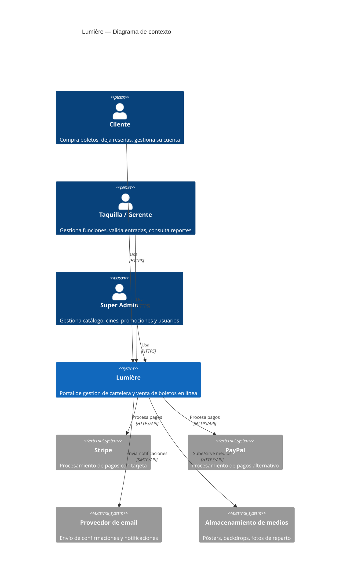
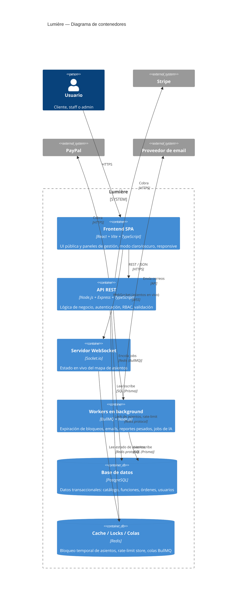

# Arquitectura — Lumière

## 1. Vista de contexto (C4 - Nivel 1)



## 2. Vista de contenedores (C4 - Nivel 2)



## 3. Estructura de carpetas (monorepo)

```
Lumiere/
  PROJECT.md
  docs/
    00-brand-lumiere.md
    01-requerimientos.md
    02-metodologia.md
    03-arquitectura.md
    04-modelo-datos.md
    05-diagramas-uml.md
    06-seguridad.md
    backend/          # doc por módulo de backend
    frontend/          # doc por módulo de frontend
  apps/
    backend/
      prisma/
        schema.prisma
        migrations/
      src/
        config/         # carga y validación de variables de entorno
        modules/         # un folder por dominio: auth, movies, cinemas, showtimes, bookings, payments, promotions, reviews, reports
          <modulo>/
            <modulo>.routes.ts
            <modulo>.controller.ts
            <modulo>.service.ts
            <modulo>.schema.ts    # validación Zod
            <modulo>.types.ts
        middleware/       # auth, rbac, error handler, rate-limit, validate
        lib/               # clientes: prisma, redis, stripe, paypal, socket.io
        jobs/               # definiciones de workers BullMQ
        sockets/             # handlers de Socket.io
        utils/
        app.ts                # construcción de la app Express (sin listen)
        server.ts              # bootstrap: listen + conexión a servicios
      package.json
      tsconfig.json
      Dockerfile
      .env.example
    frontend/
      src/
        app/              # enrutamiento, providers globales, layout raíz
        pages/            # vistas por ruta
        components/        # componentes reutilizables (UI + dominio)
        features/           # lógica por dominio (hooks + queries de TanStack Query por módulo)
        lib/                 # cliente HTTP, cliente socket, utilidades
        styles/               # tokens de diseño, tema claro/oscuro
      package.json
      vite.config.ts
      tsconfig.json
  docker-compose.yml
  .gitignore
  package.json          # workspace raíz (pnpm)
```

## 4. Decisiones técnicas y justificación

| Decisión | Alternativas consideradas | Por qué se eligió |
|---|---|---|
| **Prisma** como ORM | TypeORM, Knex + SQL crudo | Migraciones declarativas y versionadas, cliente tipado generado desde el schema (reduce errores de tipo entre BD y código), queries parametrizadas por diseño (mitiga SQLi de raíz) |
| **Redis para bloqueo de asientos** | Lock a nivel de fila en Postgres (`SELECT ... FOR UPDATE`) | Redis con `SETNX` + TTL es más simple de razonar para locks de corta duración con expiración automática, y ya es necesario para rate-limiting y colas — se reutiliza en vez de sumar infraestructura |
| **Socket.io** para mapa de asientos en vivo | Polling HTTP corto | Polling genera carga innecesaria y latencia perceptible; WebSocket da actualización casi instantánea con menor costo agregado |
| **JWT en cookies httpOnly** (no localStorage) | JWT en localStorage, sesiones en servidor | localStorage es accesible por JS → vulnerable a robo por XSS; cookie httpOnly + `SameSite=Strict/Lax` + CSRF token es el estándar de seguridad para SPA con backend propio |
| **Arquitectura modular por dominio** (`modules/<dominio>`) en vez de por capa técnica global | Estructura MVC clásica (`/controllers`, `/models`, `/routes` a nivel raíz) | Cada módulo se construye y documenta como slice vertical (ver metodología); la estructura de carpetas debe reflejar eso para que un módulo se pueda entender/tocar sin saltar por todo el árbol |
| **pnpm workspaces** sin Turborepo (por ahora) | npm workspaces, Turborepo, Nx, repos separados | Repos separados complican compartir tipos/documentación; Turborepo/Nx agregan complejidad de build cache que no se justifica hasta que exista dolor real de tiempos de build. Se usó npm workspaces temporalmente en el arranque del proyecto porque el entorno corría Node 20 (pnpm reciente requiere Node ≥22); al actualizar el entorno de desarrollo a **Node 22 LTS**, se migró a pnpm workspaces como estaba previsto originalmente — ver [docs/backend/00-foundation.md](backend/00-foundation.md) |
| **Tailwind + shadcn/ui** | Material UI, Chakra, CSS Modules puro | shadcn/ui no es una dependencia de "tema" cerrado — el código de los componentes se copia al proyecto y se personaliza libremente, lo que permite la personalidad visual de marca sin pelear contra un design system ajeno; Radix por debajo da accesibilidad real |

## 5. Ambientes y despliegue

- **Local**: `docker-compose.yml` levanta Postgres + Redis; backend y frontend corren con hot-reload fuera de contenedor (o dentro, vía perfil de desarrollo).
- **Variables de entorno**: validadas al arranque con Zod (`src/config/env.ts`) — el proceso falla rápido y con mensaje claro si falta una variable requerida, en vez de fallar silenciosamente en producción.
- **Producción** (a definir en fase de hardening final): contenedores backend detrás de proxy inverso con TLS terminado, Postgres y Redis gestionados, variables de entorno vía secret manager del proveedor elegido.
