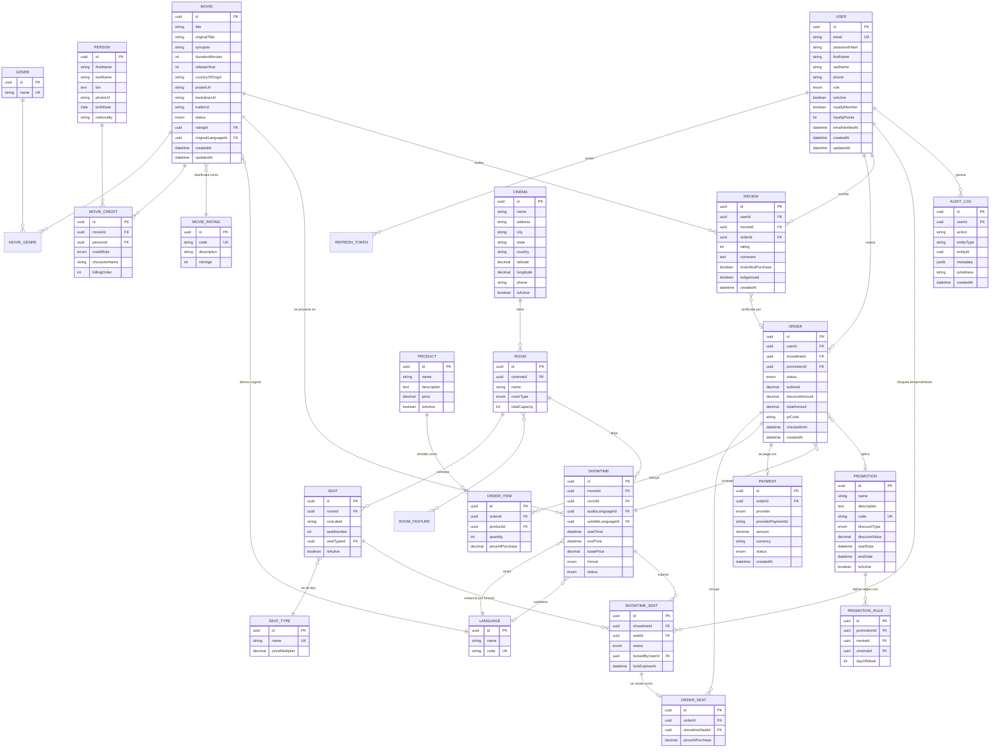

# Modelo de datos — Lumière

Este documento es la fuente de verdad conceptual del esquema. El `schema.prisma` (`apps/backend/prisma/schema.prisma`) es su implementación literal — si difieren, este documento debe actualizarse en el mismo cambio.

## 1. Diagrama entidad-relación

> Nota: `MOVIE_GENRE` y `ROOM_FEATURE` son tablas de unión simples (join tables) y se omiten sus atributos en el diagrama por claridad — solo contienen las claves foráneas de la relación.

## 2. Diccionario de datos — enums

| Enum | Valores | Uso |
|---|---|---|
| `Role` | `CUSTOMER`, `BOX_OFFICE`, `CINEMA_MANAGER`, `SUPER_ADMIN` | Rol de usuario para RBAC |
| `MovieStatus` | `COMING_SOON`, `IN_THEATERS`, `ARCHIVED` | Estado de una película en cartelera |
| `CreditRole` | `DIRECTOR`, `ACTOR` | Rol de una persona en una película (permite calcular "cantidad de películas" por persona y rol) |
| `RoomType` | `STANDARD`, `IMAX`, `VIP`, `FOUR_DX`, `DOLBY_ATMOS` | Tipo de sala — afecta precio base |
| `ShowtimeFormat` | `TWO_D`, `THREE_D` | Formato de proyección |
| `ShowtimeStatus` | `SCHEDULED`, `CANCELLED`, `COMPLETED` | Estado operativo de la función |
| `ShowtimeSeatStatus` | `AVAILABLE`, `LOCKED`, `SOLD` | Estado de una butaca para una función específica — el corazón del sistema anti-doble-venta |
| `OrderStatus` | `PENDING`, `PAID`, `CANCELLED`, `REFUNDED`, `EXPIRED` | Ciclo de vida de una orden |
| `PaymentProvider` | `STRIPE`, `PAYPAL` | Proveedor de pago usado |
| `PaymentStatus` | `PENDING`, `COMPLETED`, `FAILED`, `REFUNDED` | Estado de la transacción de pago |
| `DiscountType` | `PERCENTAGE`, `FIXED` | Tipo de cálculo de una promoción |

## 3. Decisiones de modelado clave

- **`SHOWTIME_SEAT` como entidad independiente de `SEAT`**: una butaca física (`SEAT`) pertenece a una sala; su disponibilidad es relativa a *una función específica*, no a la sala en general. Por eso cada función genera una fila `SHOWTIME_SEAT` por butaca (materializada al crear la función), que es donde vive el estado `AVAILABLE / LOCKED / SOLD` y el bloqueo temporal (`lockedByUserId`, `lockExpiresAt`). El lock efectivo en caliente vive en Redis (TTL corto); la fila en Postgres es la fuente de verdad durable una vez confirmado.
- **`MOVIE_CREDIT` unifica directores y actores** vía el enum `creditRole` sobre una única entidad `PERSON`, en vez de dos tablas separadas — una persona real puede ser directora en una película y actriz en otra; el enunciado incluso lo sugiere ("directores y actores" comparten los mismos atributos personales). La "cantidad de películas en las que participa" (RF-02) se deriva con `COUNT` sobre `MOVIE_CREDIT`, nunca se almacena como columna (evita inconsistencia).
- **`PROMOTION_RULE` separada de `PROMOTION`**: permite que una promoción aplique a múltiples combinaciones (ej. "20% los martes en cualquier cine" o "2x1 en el estreno X"), sin forzar un modelo rígido de un solo criterio por promoción.
- **`ORDER_ITEM` + `PRODUCT`**: modela combos de dulcería como líneas de orden independientes de los asientos, reutilizando el mismo `ORDER` — una compra puede incluir boletos y combos en una sola transacción.
- **`REVIEW.isVerifiedPurchase`** se deriva de si `orderId` no es nulo y esa orden está `PAID`, calculado al crear la reseña — no se confía en el cliente para marcarlo.
- **`AUDIT_LOG`** es de solo-inserción (append-only) y registra acciones sensibles (cambios de precio, cancelaciones, acciones administrativas) — requisito de la capa de seguridad de backend.
- **Todas las tablas usan `id UUID`** (no autoincremental) para no filtrar volumen de negocio en URLs públicas (ej. `/orders/{id}`) y evitar enumeración.
- **`ORDER.checkedInAt`** (agregado en la fase de validación de boletos, ver [docs/backend/10-validacion-boletos.md](backend/10-validacion-boletos.md)): marca el momento en que el código QR fue escaneado en la entrada. `null` = boleto no usado todavía. Existe específicamente para que un mismo QR no pueda canjearse dos veces (alguien reenvía una captura de pantalla) — la validación revisa este campo antes de aceptar el boleto.
