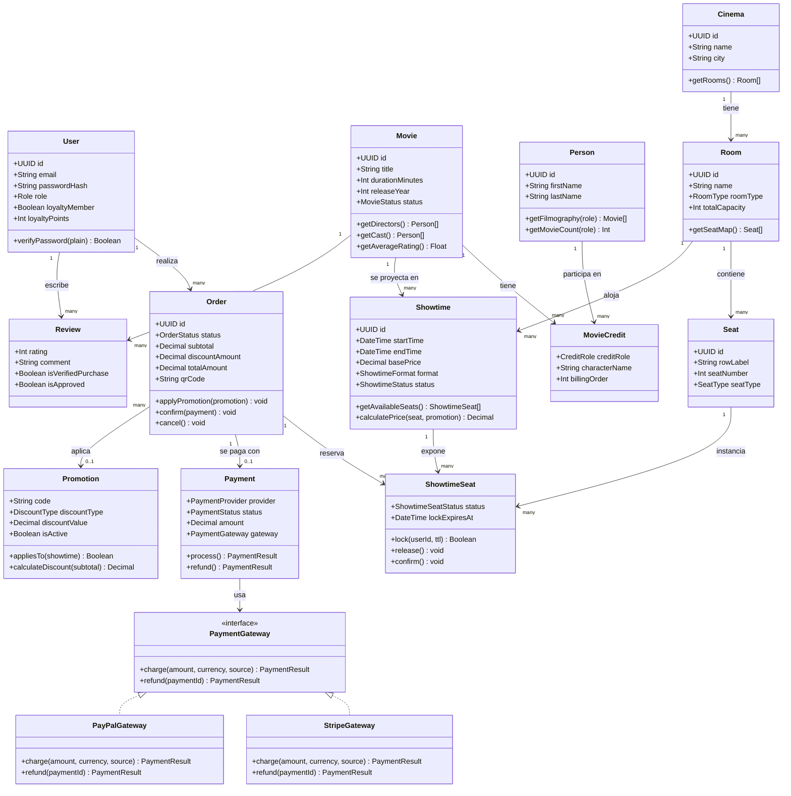
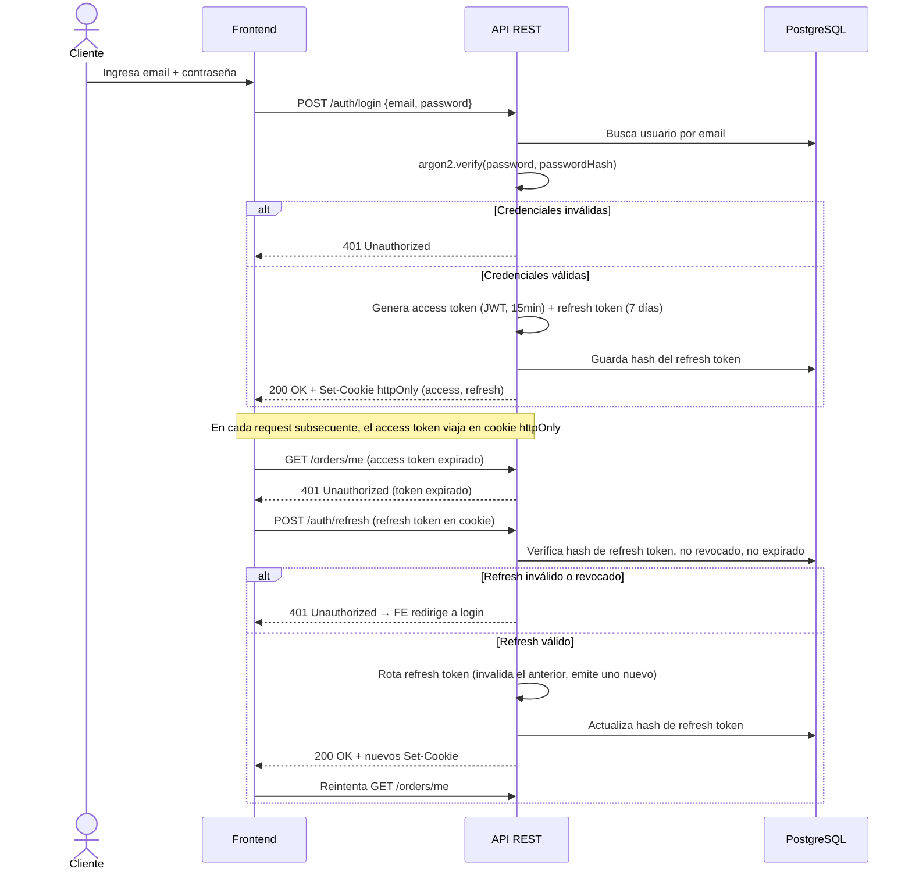

# Diagramas UML — Lumière

## 1. Diagrama de casos de uso

```mermaid
graph TB
    Cliente((Cliente))
    Taquilla((Taquilla))
    Gerente((Gerente de cine))
    Admin((Super Admin))

    subgraph Catalogo["Catálogo"]
        UC1[Consultar cartelera]
        UC2[Ver detalle de película]
        UC3[Buscar películas]
    end

    subgraph Reservas["Reservas y venta"]
        UC4[Seleccionar función]
        UC5[Seleccionar asientos]
        UC6[Agregar combos]
        UC7[Pagar con Stripe/PayPal]
        UC8[Recibir boleto con QR]
    end

    subgraph Cuenta["Cuenta"]
        UC9[Registrarse / iniciar sesión]
        UC10[Ver historial de órdenes]
        UC11[Escribir reseña]
        UC12[Gestionar puntos de membresía]
    end

    subgraph Gestion["Gestión operativa"]
        UC13[Gestionar películas, elenco y directores]
        UC14[Gestionar cines y salas]
        UC15[Programar funciones]
        UC16[Gestionar promociones]
        UC17[Validar entrada en sala]
        UC18[Moderar reseñas]
    end

    subgraph Reportes["Reportería"]
        UC19[Ver películas más vistas]
        UC20[Ver horarios de mayor demanda]
        UC21[Ver efectividad de promociones]
    end

    Cliente --> UC1
    Cliente --> UC2
    Cliente --> UC3
    Cliente --> UC4
    Cliente --> UC5
    Cliente --> UC6
    Cliente --> UC7
    Cliente --> UC8
    Cliente --> UC9
    Cliente --> UC10
    Cliente --> UC11
    Cliente --> UC12

    Taquilla --> UC9
    Taquilla --> UC17

    Gerente --> UC9
    Gerente --> UC15
    Gerente --> UC16
    Gerente --> UC19
    Gerente --> UC20
    Gerente --> UC21
    Gerente --> UC18

    Admin --> UC9
    Admin --> UC13
    Admin --> UC14
    Admin --> UC15
    Admin --> UC16
    Admin --> UC18
    Admin --> UC19
    Admin --> UC20
    Admin --> UC21
```



## 2. Diagrama de clases (dominio principal)



*Nota de diseño*: `PaymentGateway` se modela como interfaz con implementaciones `StripeGateway` / `PayPalGateway` (patrón Strategy) — el módulo de pagos depende de la abstracción, no del proveedor concreto, lo que permite agregar un tercer proveedor sin tocar la lógica de órdenes.

## 3. Diagrama de secuencia — Compra de boletos con bloqueo de asiento

```mermaid
sequenceDiagram
    actor C as Cliente
    participant FE as Frontend (React)
    participant API as API REST
    participant WS as Socket.io
    participant R as Redis
    participant DB as PostgreSQL
    participant PG as Stripe/PayPal

    C->>FE: Selecciona función y asientos
    FE->>API: POST /showtimes/:id/seats/lock {seatIds}
    API->>R: SETNX lock:seat:{id} = userId (TTL 8min)
    alt Asiento ya bloqueado por otro usuario
        R-->>API: false
        API-->>FE: 409 Conflict (asiento no disponible)
        FE-->>C: "Ese asiento ya no está disponible, elige otro"
    else Asiento libre
        R-->>API: true
        API->>DB: UPDATE showtime_seat SET status=LOCKED, lockedByUserId, lockExpiresAt
        API->>WS: emit("seat:locked", {seatId})
        WS-->>FE: Actualiza mapa de asientos en vivo (otros clientes)
        API-->>FE: 200 OK (asientos bloqueados, expiran en 8min)
    end

    C->>FE: Agrega combos y confirma orden
    FE->>API: POST /orders {showtimeId, seatIds, items, promotionCode?}
    API->>DB: Valida reglas de promoción, calcula subtotal/descuento/total
    API->>DB: INSERT order (status=PENDING)
    API-->>FE: 201 Created {orderId, totalAmount}

    C->>FE: Ingresa datos de pago
    FE->>API: POST /orders/:id/payments {provider, paymentMethodToken}
    API->>PG: Crear cargo por totalAmount
    alt Pago exitoso
        PG-->>API: charge succeeded
        API->>DB: UPDATE order SET status=PAID; UPDATE showtime_seat SET status=SOLD
        API->>R: DEL lock:seat:{id} (para cada asiento)
        API->>WS: emit("seat:sold", {seatIds})
        API-->>FE: 200 OK {order confirmada, qrCode}
        FE-->>C: Confirmación + boleto con QR
    else Pago falla
        PG-->>API: charge failed
        API->>DB: UPDATE order SET status=CANCELLED
        API-->>FE: 402 Payment Required
        FE-->>C: "El pago no pudo procesarse, tus asientos siguen bloqueados N min"
    end

    Note over R,DB: Job en background (BullMQ) expira locks vencidos: si lockExpiresAt < now y status=LOCKED, vuelve a AVAILABLE y libera en Redis
```

## 4. Diagrama de secuencia — Autenticación (login + refresh)


